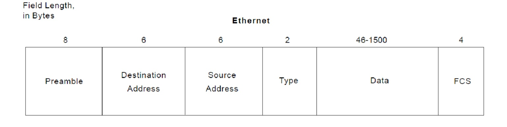

# Packet Analyzer

a packet analyzer application to analyze ethernet frames and break down the signal to it's own fields insted of a continuous stream of data.

## Assumptions

1. the signal is saved in the HEX format as string in a file.
2. all the provided signal are verfied and correct, will only perform the analysis.
3. we are only interest to break down the Enhanced Common Public Radio Interface (e-CPRI) frames built over Ethernet and raw ethernet frames.

## Description

there is 3 main classes, the first one the packet reader (PacketReader).

used the singleton design pattern, cause there should be only one source for the ethernet packets, and to avoid any conflicts made the class providing only one object to handle its reading operations.

the same thing is for the 3rd class which is the analyzed packet writer.

and for the analyzer it is breaking down the string and mapping it to it's corresponding field so the packet writer use this map to prepare the analyzed signal to be written into a file.

## Notes

1. you can change the input packets file name from the #define PACKET_FILE_NAME in the PacketReader.cpp.
2. you can change the output file name from the #define WRITE_FILE_NAME in the AnalyzedPacketWriter.cpp
3. i broke down the signal and saved it all, despite knowing which parts of the signal i will need, so if we wanted the Preamble or the data of the packet we can easily retrieve it using the map mentioned in the description section.

## Authors

- [@Muhammed-Magdy-Abdelhady](https://github.com/Muhammed-Magdy-Abdelhady)

- [@Ahmed Osama Ismail](https://github.com/ahmedosamaismail)
