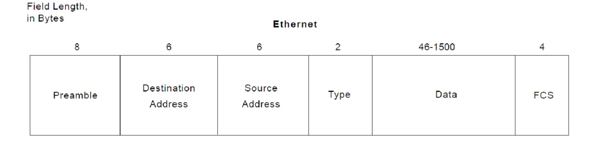

# Packet Analyzer



A modern C++ application for analyzing Ethernet frames, with a focus on Enhanced Common Public Radio Interface (e-CPRI) and raw Ethernet packets. The analyzer reads HEX-formatted packet data, decodes protocol fields, and outputs detailed breakdowns for debugging and research.

---

## 📋 Assumptions

1. The signal is saved in HEX format as a string in a file.
2. All provided signals are verified and correct; the analyzer only performs analysis.
3. The focus is on breaking down Enhanced Common Public Radio Interface (e-CPRI) frames built over Ethernet and raw Ethernet frames.

---

## 🚀 Building the Project

1. **Clone the repository:**
   ```sh
   git clone https://github.com/Muhammed-Magdy-Abdelhady/Packet-Analyzer.git
   cd Packet-Analyzer
   ```

2. **Build using CMake:**
   ```sh
   mkdir build
   cd build
   cmake ..
   cmake --build . --config Debug
   ```

3. **Run the analyzer:**
   ```sh
   ./build/debug/packet_analyzer.exe input_data.txt
   ```
   *(Adjust the path and executable name as needed for your platform.)*

---

## ✨ Features

- Analyze and decode Ethernet frames from HEX-formatted files.
- Full support for e-CPRI frames and raw Ethernet frames.
- Modular, object-oriented design using abstract base classes and inheritance.
- Extensible architecture for supporting new packet types.
- Output breakdown of all relevant fields, including Preamble, CRC, addresses, and protocol-specific data.
- Input file name is provided as a command-line argument; output is written to `packets.txt` by default.

---

## 📝 Project Description

The Packet Analyzer is structured around several main components:

- **PacketReader**: Reads packets from a HEX-formatted file using a pluggable reader type (e.g., file or socket).
- **Packet**: Abstract base class representing a generic packet, with two concrete subclasses:
  - RawPacket for standard Ethernet frames.
  - eCEPRIPacket for Enhanced CPRI frames.
- **PacketCreator**: Factory for creating the correct packet type based on the data.
- **AnalyzableWriter**: Writes analyzed packet data to an output stream (file or otherwise).

Each packet type implements its own breakdown logic, allowing the analyzer to support multiple protocols cleanly. The analyzer reads, identifies, and delegates the breakdown of each packet to the appropriate class.

---

## ⚙️ Configuration Notes

- **Input**: It can be either a File or a Socket and can be scaled to add new ways.
- **Output**: It can be any type of Output stream.
- All fields of the signal are saved and accessible for further analysis.

---

## 👨‍💻 Authors

- [@Muhammed-Magdy-Abdelhady](https://github.com/Muhammed-Magdy-Abdelhady)
- [@Ahmed Osama Ismail](https://github.com/ahmedosamaismail)
